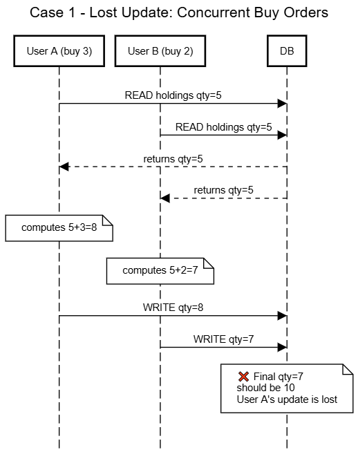

Concurrency Control 

Case 1- Lost Update: Concurrent Buy Order 
When two users are trying to buy the same stock at the same time. 
Both will read the current quantity and add their amounts separately and write it back. The second one will then overwrite the first one.

Sequence Diagram 

Lost update is basically when the first one (A) is overwritten by the second one(B)  because both transactions read the same initial value. 
The Fix is simple: use FOR UPDATE in order to lock the row when reading  before making any changes like buy or sell. This only locks the specific row allowing for concurrent buys of other stocks. 

Case 2 -Non-repeatable read: cash balance check
A user tries to buy a stock, which reads the balance  before a purchase to see if they have enough money. Before that, another concurrent buy confirms commits and spends the money and the remaining money is not enough

Sequence Diagram 

This is non-repeatable read; the same row is read twice and returns different values because a transaction is committed between the two reads. The fix is to use a repeatable read isolation so the balance stays consistent during the check, making sure it doesn't change mid-transaction 

Case 3 Non-repeatable read -  buy request and confirm mismatch 
In this case let's say the user is trying to buy a stock. The preview shows it’s 80 dollars but as the user is about to confirm the purchase the price updates to 120. It doesn't warn the user and they overspend. 

Sequence Diagram 

 
 
 This is a non-repeatable read; the same row is read twice and returns different values because a transaction is committed between the two reads. The fix is to lock the price at the request time rather than reading it again and having the value change in between.This is the pattern e-commerce use and the one explained in class with the Amazon example. 
